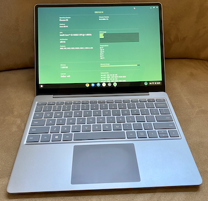
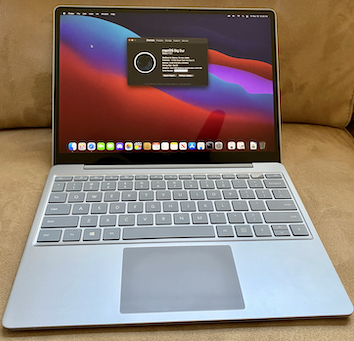

# Microsoft Surface Laptop Go
Install guide for booting Mac OS, Linux and ChromeOS with Brunch.

### Upgrade that SSD...
This guide is for the 128GB / 256GB version only, as they have NVMe SSDs. If you have a 64GB it is EMMC, and part of the motherboard, so you can't upgrade it.
- On Surface laptops with M.2 drives like this one, upgrading the SSD is quite easy. Just make sure to create a recovery drive before you start - any external USB with 16GB of space will do.
- Follow [MrHG78's guide](https://www.youtube.com/watch?v=BXXI4VcWacM) for instructions on a different Surface, but it's the same procedure. 
- Watch [this teardown video](https://www.youtube.com/watch?v=jzRb_3U2vs0) to see how you remove the bottom screws (be gentle removing the rubber strips!), then carefully lift off the keyboard. You don't need to disconnect the keyboard but you can if you want to. You'll see the black rectangular metal shield covering the NVMe drive. Gently wiggle that out and replace the SSD.
- You'll want the new 1TB SSD to be formatted as NTFS or else you can't recover from your USB to the internal drive. 

### Disclaimer

As per usual, the process described in this document could cause irreversible damage to your laptop, and I accept absolutely no responsibility for the consequences of anyone choosing to follow or ignore any of the instructions in this document, and make no guarantees about the quality or effectiveness of the software in this repo.

### Microsoft Surface Laptop Go Hardware
Specs:
-  CPU: Intel i5-1035G1 (Icelake)
-  GPU: Intel UHD Graphics (Iris Plus Graphics G1)
-  RAM: 8GB Soldered to motherboard
-  Wifi: Intel Killer Wifi 6 AX1650i (201NGW)
-  Audio: Intel Ice Lake-LP Smart Sound Technology (Realtek ALC274 codec)
-  Touchpad: ELAN 
-  SSD: 128GB or 256GB NVME M.2 - as noted, definitely worth upgrading.

### OS Compatibility Current Status
This hardware is quite simple to configure and works well with all three options. Note: for GNU/Linux, I've had the best success with Manjaro so far. On Fedora, everything except power management works but the battery was not recognized.

| Hardware           | GNU/Linux            | Mac OS              | Brunch		|
|--------------------|----------------------|---------------------|-----------------|
| WiFi               | Working              | Working             | Working         | 
| Bluetooth          | Working              | Working             | Working	        | 
| Suspend / Sleep    | Working              | Not Working         | Working         | 
| Touchpad           | Working	            | Working             | Working     | 
| Graphics Accel.    | Working              | Working	            | Working    	    | 
| Sound              | Working              | Working             | Working	    | 
| Touchscreen        | Working              | Working             | Working         | 
| Screen brightness  | Working		          | Working	            | Working	    | 
| Power Management   | Working (Manjaro)    | Not Working	        | Working	    | 

## Part 1: Disable bitlocker, TPM, and partition your SSD

Windows 11 should be installed first if you want to use it.
- Hold Volume UP and press power until the UEFI boot menu appears. In security, disable TPM.
- Back in Windows, disable bitlocker, or you'll have to enter a lengthy code every so often, and I decided it's not worth it. (There are solutions in place for using TPM, bitlocker and OpenCore, you can Google that if you want to set it up. 
- Hold Volume DOWN and press enter to boot to USB for installing Linux, Mac OS, etc. 
- In Windows (or using a Linux Live USB) make sure to partition your drive before jumping in to installing Mac OS. 

## Part 2: Linux (Manjaro, Fedora)
Burn ISO, boot and configure. Manjaro worked with full functionality except the fingerprint reader.

## Part 3: MacOS 
 
MacOS also works quite well, except for battery percentage, fingerprint reader and the touchpad is a bit wonky. Start with the lastest version of Opencore. I useed Big Sur on this hardware, YMMV with Monterey. 
 
1. Download and set up your Mac OS X Big Sur USB install media. [gibMacOS](https://github.com/corpnewt/gibMacOS) 
    - Before you make the install USB, make sure it is formatted as APFS with GUID Partition Map.
    - To create the installer, one easy option is [TINU](https://github.com/ITzTravelInTime/TINU).

2. Create your EFI based on the latest OC Guide for [this IceLake generation](https://dortania.github.io/OpenCore-Install-Guide/config-laptop.plist/icelake.html). A few notes on getting OpenCore to work, in my case:
  - Airportitwlm works perfectly with this wifi card, just make sure you get the version for version of MacOS you're using.
  - I tried all combinations of the ALC274 codec with AppleALC. No luck, but VoodooHDA works well. For now, I'll take it. Note: on Big Sur 11.3+ there is a fix that needs to be applied for audio to work, see [this post](https://www.insanelymac.com/forum/topic/314406-voodoohda-297/?do=findComment&comment=2756841) for more details.
  - VoodooI2C + VoodooI2CHID will enable the touchscreen, but the touchpad won't work.
  - VoodooI2C + VoodooI2ELAN will enable the touchpad, but the touchscreen won't work. I opted for this. 
  - For iGPU to work, you'll need the iGPU.plist I've included in this repo in your device properties section. 
  - Battery readouts may never work. Recent Surface models don't use ACPI Operating Regions/Fields to get their battery info.
    
3. When the Mac OS install media is ready, mount the EFI partition with the [MountEFI](https://github.com/corpnewt/MountEFI) utility and copy the contents of the latest EFI linked above into this partition.

4. Boot from the Mac OS installer. In Disk Utility, go to Show All Devices in the top left, and then select the entire drive, and format the partition you have identified for MacOS and make sure to use APFS.
  
5. You will need to copy the EFI to your insternal SSD drive using the same procedure from step 3. In the UEFI boot settings (Hold Volume UP at boot) make sure you move Windows Boot Manager down in the list of boot options, so that USB boot and internal boot are in the first two spots. This will ensure the computer uses OpenCore as a boot option prior to Windows Boot Manager. 

## Part 4: Brunch - install ChromeOS on a partition.  
Brunch installs really well on this machine, virtually everything works. Follow the dual boot instructions below, with a few notes:
 - The install instructions fail if booting from a Linux Live USB, as we only have 8GB of RAM and it fills up quickly with the Chrome OS image. To get around this, you will need to have Linux installed first in a partition.
 - Fingerprint reader does not work (expected behavior)   

 1. Read the instructions on the official Brunch repo: [https://github.com/sebanc/brunch](https://github.com/sebanc/brunch)
 2. [Go to CrOS Updates](https://cros-updates-serving.appspot.com/) and search for "rammus", then download the latest recvovery. 
 3. You will need either an external mini SD card / USD to run Brunch off of, or you can create an EXT4 partition on the internal drive. Make sure it is at least 14GB in size - probably bigger than that if you plan to install any apps.
 4. After installing using the steps in the Brunch guide, you will be provided with a Grub menu to copy into your bootloader. 

